# Итоговый проект: Фреймворк Spring и работа с REST API

# Введение

Проект представляет собой разработку REST API для системы бронирования отелей на базе Spring Boot с использованием
микросервисной архитектуры.

Цель — создать распределённое приложение с несколькими сервисами, реализующими основные функции бронирования, управления
гостиницами и маршрутизации запросов через API Gateway.

## Компоненты системы

Проект состоит из 4 сервисов:

1. Gateway - шлюз, осуществляющий маршрутизацию запросов
2. Management - управление отелями и номерами.
3. Reserver - создание бронирований и управление ими, регистрация и авторизация пользователей, администрирование.
4. Eureka - cервер регистрации и динамического обнаружения сервисов

## БД

БД реализована в сервисах Management и Reserver. В качестве БД используется H2, я сделал файловую версию БД для удобства
тестирования.

Reserver:

* Таблица users: id, username, password, role.
* Таблица bookings: id, user_id, room_id, start_date, end_date, status (PENDING/CONFIRMED/CANCELLED), created_at.

Management:

* Таблица hotels: id, name, address.
* Таблица rooms: id, hotel_id, number, available, times_booked.


## API

Реализовано согласно условиям задачи

**Booking Service**
* DELETE /user — удалить пользователя (ADMIN).
* POST /user — создать пользователя (ADMIN).
* PATCH /user — обновить данные пользователя (ADMIN).
* POST /booking — создать бронирование (с выбором или автоподбором комнаты) (USER). В теле запроса параметр autoSelect: true/false (при true поле roomId игнорируется).
* GET /bookings — история бронирований пользователя (USER).
* POST /user/register — зарегистрировать пользователя, сгенерировав токен (USER).
* POST /user/auth — авторизовать пользователя, сгенерировав токен (USER).
* GET /booking/{id} — получить бронирование по id (USER).
* DELETE /booking/{id} — отменить бронирование (USER).

**Hotel Management Service**
*  POST /api/hotels — добавить отель (ADMIN).
*  POST /api/rooms — добавить номер в отель (ADMIN).
*  GET /api/hotels — получить список отелей (USER).
*  GET /api/rooms/recommend — получить список рекомендованных номеров (USER) (те же свободные номера, отсортированные по возрастанию times_booked).
*  GET /api/rooms — получить список всех свободных номеров (USER) (без специальной сортировки).
*  POST /api/rooms/{id}/confirm-availability — подтвердить доступность номера на запрошенные даты (временная блокировка слота на указанный период, используется в шаге согласованности) (INTERNAL).
*  POST /api/rooms/{id}/release — компенсирующее действие: снять временную блокировку слота (INTERNAL). Маршрут не публикуется через Gateway.

## Security

Для обеспечения безопасности использует shared компонент в модуле **common**. В нем реализована логика по хранению и
применении секретного ключа при создании и валидации JWT.

Логика формирования ключа содержится в сервисе reserver т.к он отвечает за авторизацию и регистрацию пользователей,
что соответствует условиям задания. Хочу отметить, что в этой части в условиях задачи есть противоречие, в условиях сказано, 
что сам сервис должен проверять jwt, однако в описании критериев приемке написано про то, что gateway должен содержать 
компонент аутентификации. Считаю, что в таком случае, допустимы оба варианта выполнения. Сделал тот, который первый увидел.


Итк, проверка токена выполняется в самом сервисе с помощью:

```
                .oauth2ResourceServer(oauth2 -> oauth2
                        .jwt(jwtConfigurer -> jwtConfigurer
                                .decoder(jwtDecoder)
                                .jwtAuthenticationConverter(jwtAuthenticationConverter()))
                );
```

Далее рассмотрим демонстрацию работы

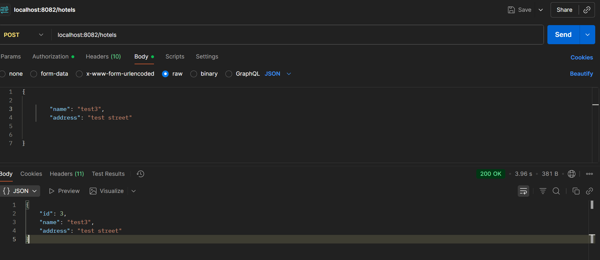


Также, в системе реализована ролевая модель. В системе две роли: ADMIN, USER. Далее демонстрация того, что для обычного
пользователя недоступны эндпоинты предназначенные для админа.

Например, попробуем создать отель (данный функционал доступен только для админа). Данный пользователь создается
в [data.sql](reserver/src/main/resources/data.sql)
т.к админа может создать только админ и иначе стартового пользователя не создать.


А теперь попробуем зайти под обычным пользователем


## Gateway

Для маршрутизации запросов используется единая точка входа. Ниже демонстрация работы с двумя сервисами, по одному
адресу:

Ниже пример обращение в management за списком созданных отелей

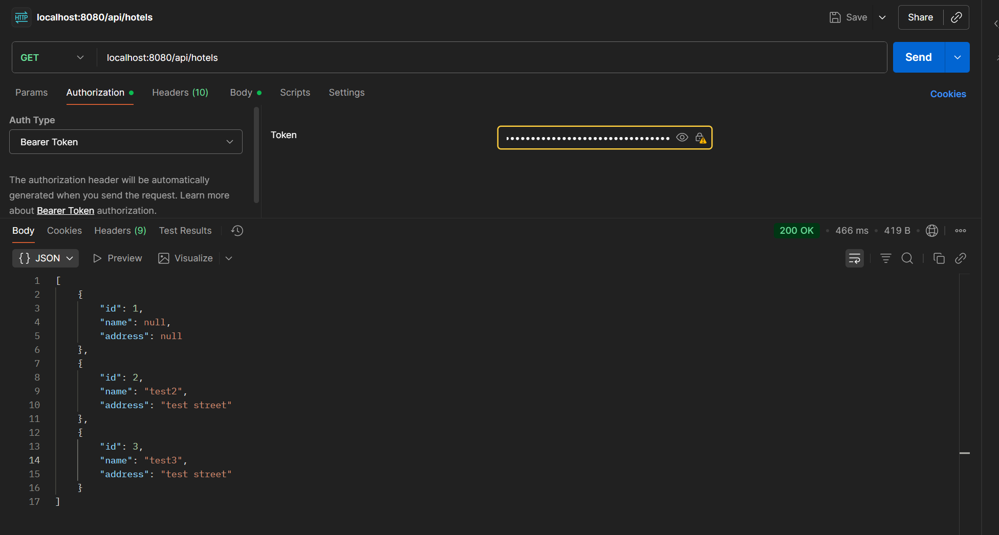

А вот в reserver, например за авторизацией

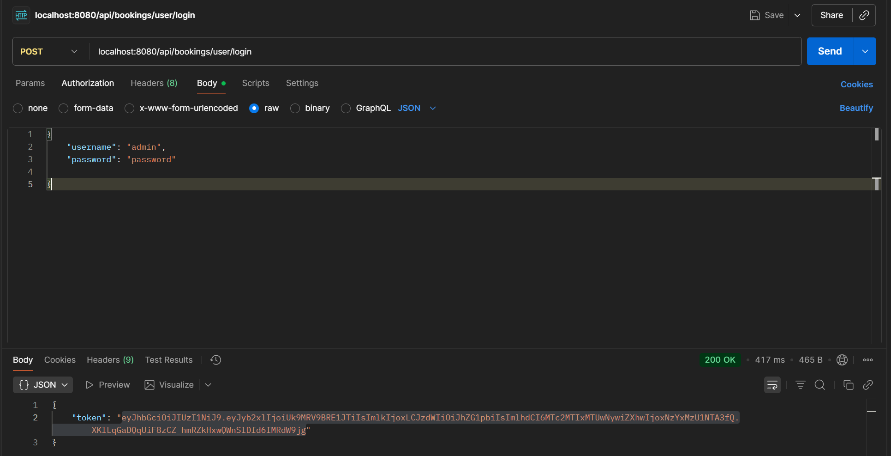

## Eureka

Далее демонстрация работы сервиса для регистрации сервисов

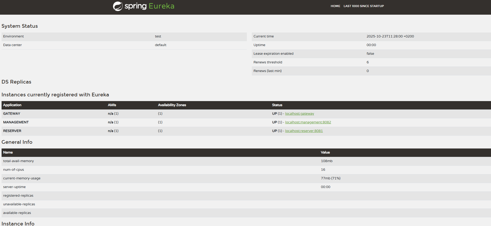

## Swagger

Для документации сервисов используется OpenApi.

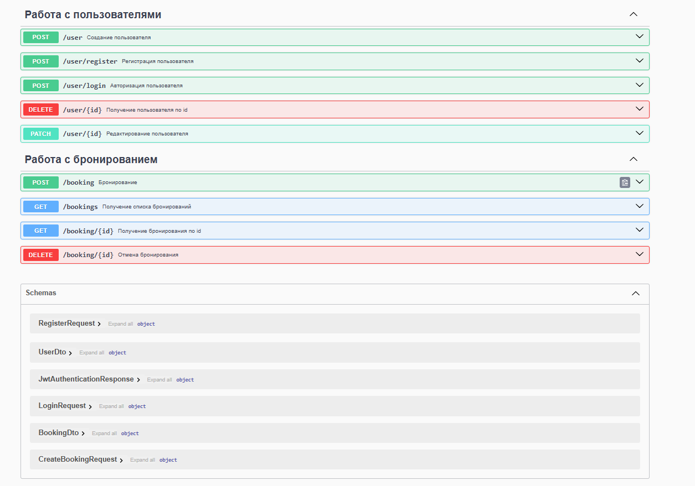

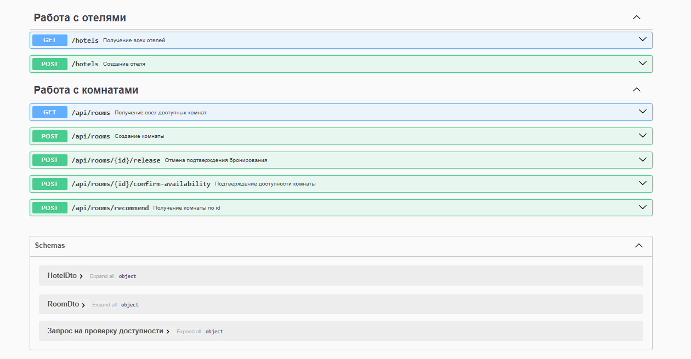

## Тестирование

Для тестирования используются юнит тесты. Тестами покрыты все сервисы и контроллеры.

Тесты для модуля management
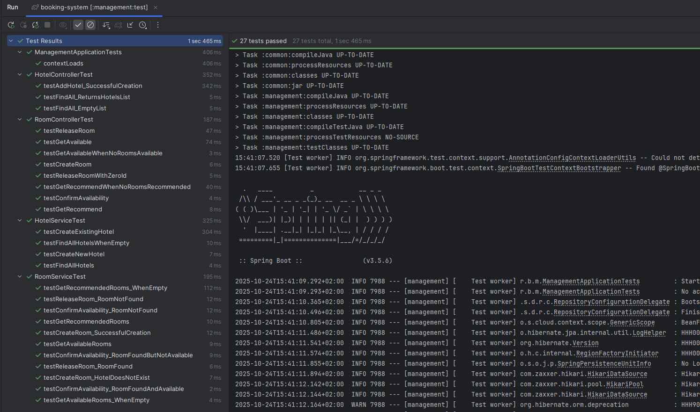

Тесты для модуля reserver
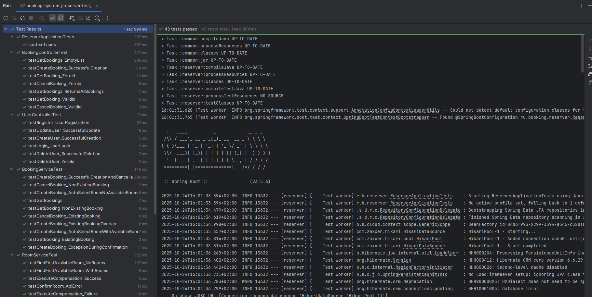

## Создание бронирования

Т.к основным сценарием использования данного приложения является создание бронирования. То, я решил продемонстрировать
основную бизнес логику именно в этом кейсе.

Повторим основные условия

```
Booking Service вызывает Hotel Management Service для подтверждения доступности номера.
 При успешном ответе бронирование переводится в статус CONFIRMED.
 При ошибке или истечении времени ожидания выполняется компенсация: бронирование переводится в статус CANCELLED,
  временная блокировка слота в Hotel Service снимается (через эндпойнт POST /api/rooms/{id}/release), 
  если на этапе подтверждения доступности была установлена блокировка.
```

Создание отеля я уже демонстрировал выше. Создадим комнату.
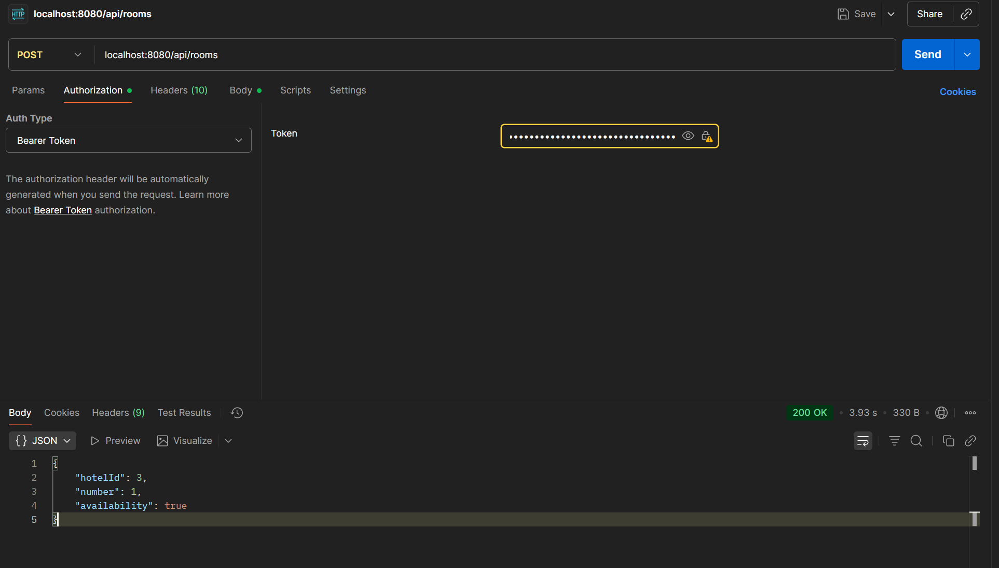

Далее на нужно создать бронирование, попробуем создать с автоподбором комнаты. В случае если все прошло, то бронирование создается в статусе CONFIRMED
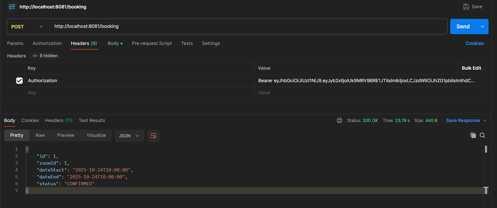

Если, допустим, возникла ошибка при создании бронирования(не найдено свободных комнат при использовании механизма автоподбора).
То вернется обработанная ошибка.
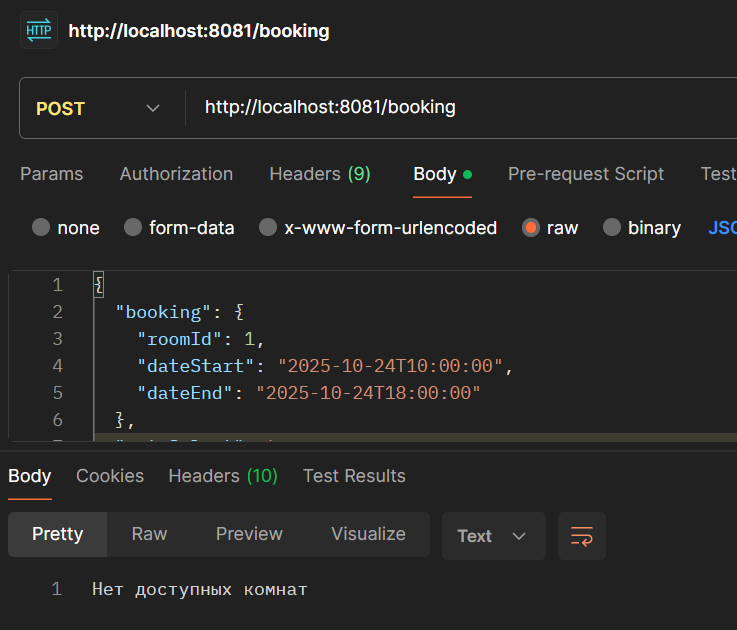!

Если же подтвердить бронирование не получится или возникнет ошибка при обращении в сервис, то будет выполнена компенсация 
"rooms/%s/release" и статус бронирования будет выставлен как CANCELLED. В примере ниже рассмотрена ситуация когда
комната недоступна для бронирования.
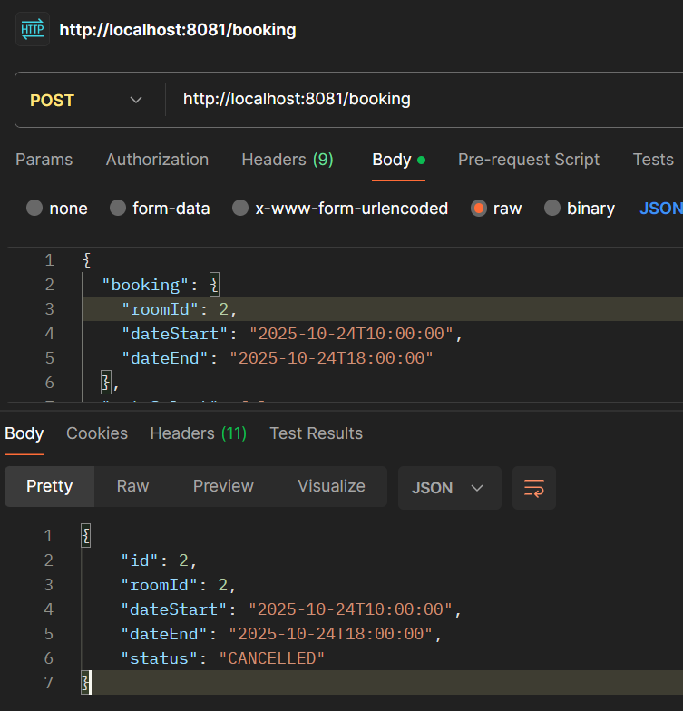


